# Solent Library Food Delivery Web Application

**Name:** Jasmine Harwood (14423316)  
 

**Hosted Website Link:** Website is hosted [here.](https://library-delivery-application.web.app/explore)  
 

**Git Repository Link:** GitHub Repo can be found [here.](https://github.com/jasharwood/library-delivery-app)  
 

**Word Count:** 1,578

   

## Introduction

 

This project involved addressing a problem that students at Solent University face with a single page web application. The problem I set out to solve was getting hungry or needing a coffee mid-way through a library study session and having to leave to purchase food/drinks, which leads to losing a seat and a disruption in workflow. In the first half of this project I surveyed 22 students to gather insights on their library and food delivery habits, produced a list of requirements (Appendix A) based on user needs, brainstormed solutions to these needs and how they could be incorporated into the application, and integrated the solutions within a mock-up using Figma (Appendix B). 

This phase of the project involved the actual implementation of the mock-up into a functional and usable proof of concept web application. This documentation details the overall methodology I used to manage the project and the methods I used to evaluate my solution with users. The results were largely positive with a few proposed changes and additions. Based on these results and my reflective account, my solution was evaluated and a future recommendations list was created.

  

## Methods 

 

### Overarching Methodology 

 

The overarching methodology I used since the start of this project was the Design Thinking (DT) methodology - a user-centric, iterative process that takes a problem-solving approach. This phase of the project involves the prototype and testing phases of the DT methodology. The prototype phase involved the actual implementation of the mock-up - implementing the solutions to the problem that I originally set out to solve. The testing phase of the project included the evaluation of my solution with a representative user base to gain valuable insights. The results generated from this testing phase were then used to define future tasks and/or recommendations.

During the prototyping phase I used a development methodology called ["Extreme Programming For One"](https://wiki.c2.com/?ExtremeProgrammingForOne). This is an adaptation of the Extreme Programming methodology and follows an agile approach. After researching how other developers have utilised this adapted methodology, it became clear that there are conflicting ideas surrounding exactly how it should be carried out. However, there were a few core, recurring tasks which I implemented as follows;

- **Create user story:** A narrative that involves a description of the scenario that the user finds themselves in;
- **Derive tasks:** Engineering tasks are derived from the narrative and must be done so the user story can be achieved;
- **Set priority:** This involves setting the priority level of the task;
- **Acceptance testing:** Test to check that the feature operates effectively, and so the scenario set out in the user story can be fulfilled.

The above represents one iteration/one sprint. The process was repeated with different user stories to address each requirement. As the mock-up I created on Figma was highly complex and would've required a multitude of features and/or functionality, I decided to focus on the requirements with high and medium priority (Appendix A). A total of 4 iterations were carried out, each with a focus on one of these high to medium priority requirements (Appendix C).

 

### Methods

 

To evaluate the success of this project, I set up meetings with 5 students from Solent University on Microsoft Teams, introduced the product, gave them a demo and conducted an interview with them. I collected data using surveys during the first half of the project as this allowed me to gather a large amount of data, quickly, to provide insights on student habits. However, this phase of the project called for a more in depth evaluation of my solution. Therefore, interviews were my data collection method of choice as they allowed me to explore opinions and experiences with the product in more detail.

Before starting the interview process I needed to consider the questions that would be asked. I decided to conduct a semi-structured interview - the questions were developed before the interview process to ensure I could obtain the information that I set out to. However, if necessary, follow-up questions were asked to explore the interviewee's answers in more depth [(Knox, S. and Burkard, A.W., 2009)](https://epublications.marquette.edu/cgi/viewcontent.cgi?article=1121&context=edu_fac).

Microsoft Teams was the chosen platform to conduct interviews as Solent University students are already familiar with this. Conducting interviews virtually allowed me to interview students that live far away from me. On the other hand, this did mean there was a slight reduction in social cues as all interviewees had their cameras turned off, so extra information could not be derived from their body language [(Opdenakker, R., 2006)](https://www.qualitative-research.net/index.php/fqs/article/view/175).

To address ethical concerns, interviewees were informed of the purpose of the survey and what the data gathered would be used for. I explained that their involvement in the interview was completely voluntary, they had a right to withdraw at any time and they will remain anonymous. 

Each interview was recorded and interview transcripts were typed up to allow me to reflect on and evaluate the results (Appendix D).

 

### Reflective Account

 

Overall, I am incredibly proud of the functionality I managed to implement in this project. As my mock-up in Figma was so large and required lots of functionality, the decision to focus on the most important requirements was one that had to be taken. Due to this decision, some features of the design needed to be changed to ensure these requirements were met. For example, add to cart buttons were added to each individual food item rather than within the pop-up as I could not get the latter to work. The library seat selection was added to the cart area instead to ensure users could see how this feature would work at this point in time. I was also unable get the orders page up and running as I couldn't work out how to parse in the information from the cart to display there. I unfortunately have not managed to make the site responsive at this stage and chose to focus on desktop (optimised for a screen size of 1400 x 900px). The reason behind this was that as this was a proof of concept, the highest priority was to demonstrate the functionality of the product and how it works, rather than optimising it for various screen sizes (at this stage).

Despite these limitations, I did manage to implement all 4 of the requirements that I chose to focus on; delivery times, plenty of food choices, a good user experience and easy navigation. On top of this, I also managed to implement an effective shopping cart so users can add items, remove items, change the quantity and more. Although I initially found React really difficult to get my head around, by the end of the project I had developed a firm grip on how to use loops, styled-components, states and hooks, and routing.

  

## Conclusion/Results

 

The ideal solution for this project would be one that solves the problem I set out to solve. Overall, all interviewees felt the app solved this problem as it enabled students to get food delivered directly to their desk in the library. However, one interviewee did feel it was hard to say at this stage due to the fact that payment and order tracking had not been implemented yet. The most popular response when asked what they liked about the product was the design (60% answered this). The 4 requirements that I set out to implement were explored in the interview - the results were largely positive but a few good points were made. Interviewees felt the delivery times were clear and visible, but 2 people mentioned they would like to have been able to filter by delivery time. Similarly with restaurant choices, one interviewee stated they would've liked to filter the restaurants by price or allergens. The responses regarding user experience included being simple, quick, and easy to find what you need. Interviewees also liked the navigation as it was easy to use, not hidden away and clear. One interviewee did mention perhaps adding text under each icon in case they weren't obvious to some users. Interviewees were also asked what they'd like to see added to the product in the future. Based on these answers, and the suggested changes that were put forward earlier in the interview, a future recommendations list was created; 

- Add search bar to seat selection drop down
- Add ability to view more details for each food item
- Add a button to remove items from the cart rather than reducing the quantity to 0
- Add payment functionality 
- Add order tracking
- Add filters (delivery time, allergens, price)
- Add offers e.g. meal deals
- Add text under each icon
- Add ability to favourite restaurants

 

Based on my own reflective experiences, I would also add;
- Finish the orders page
- Make the web app responsive

 

Overall, the response to the current proof of concept Solent Library Food Delivery App were positive and interviewees felt it solved the problem I set out to solve. Although I was not able to implement all of the functionality in the Figma mock-up, each of the 4 highest priority requirements were implemented as proof of concept and received a positive response. From this experience, I feel my knowledge and understanding of React JS has improved massively. I now feel more confident in my own abilities with this coding language and feel certain that, with a little more practice, I would be able to implement the list of changes and future recommendations. 

  

## Appendix 

 

### Appendix A
#### Requirements List:

 

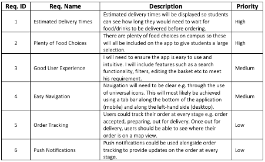  

 

### Appendix B
#### Figma Mock-up:

 

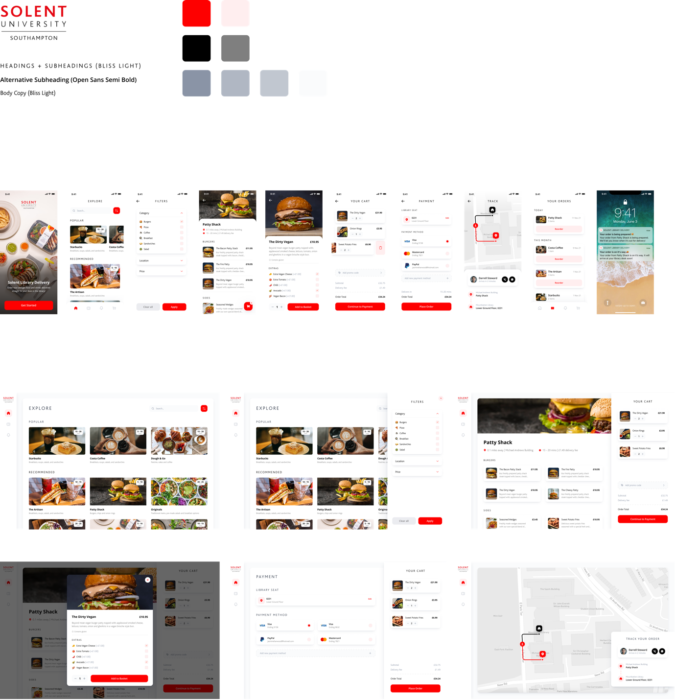

 

### Appendix C
#### User Stories/Iterations:

 

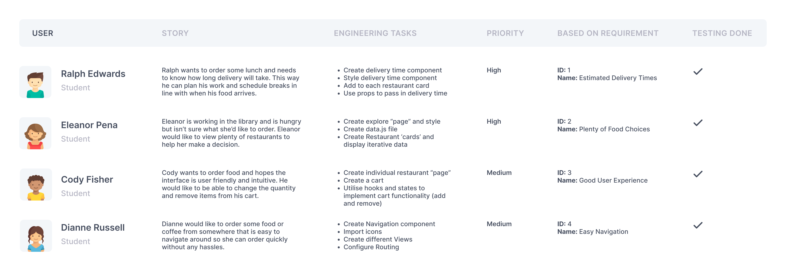

 

### Appendix D

#### Interview Transcripts:

 

##### Interview 1:

 

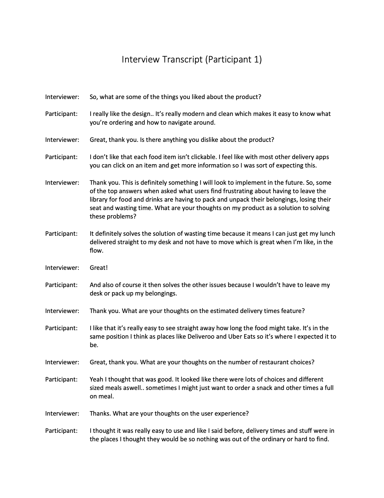

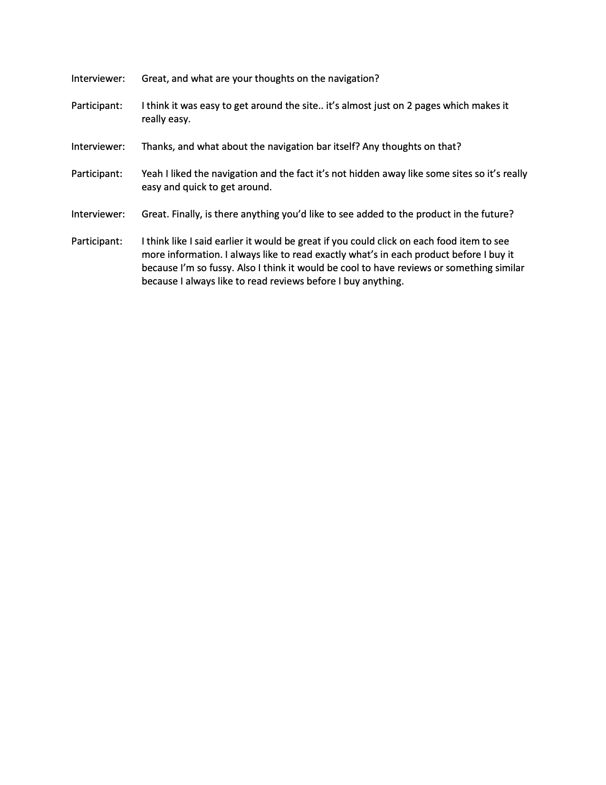

 

##### Interview 2:

 

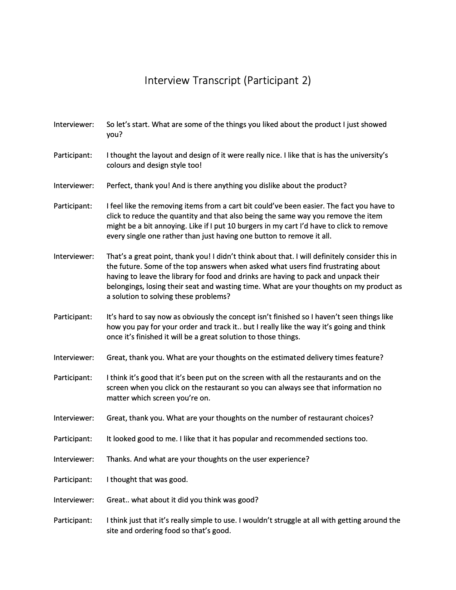

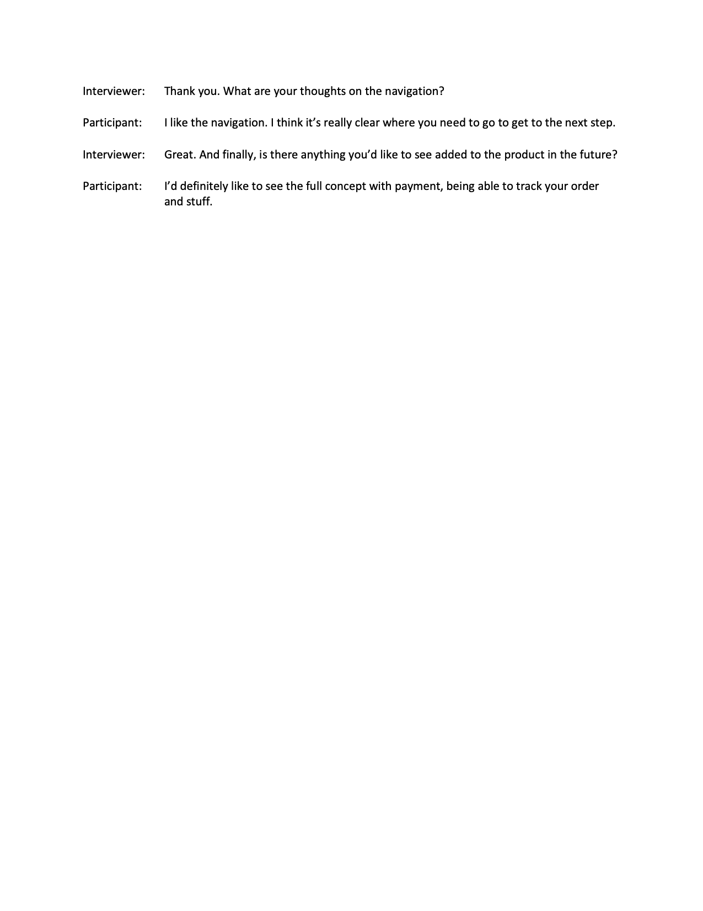

 

##### Interview 3:

 

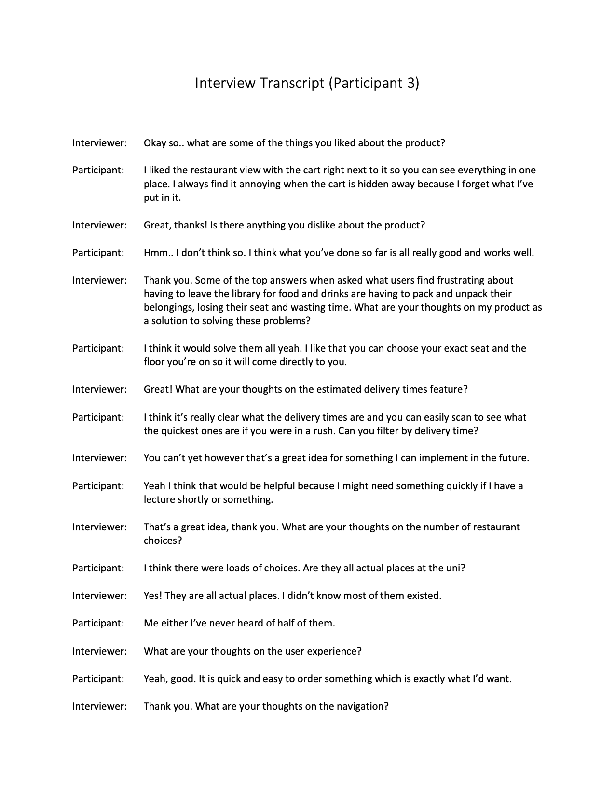

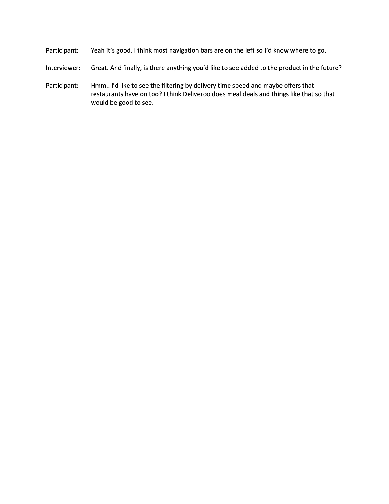

 

##### Interview 4:

 

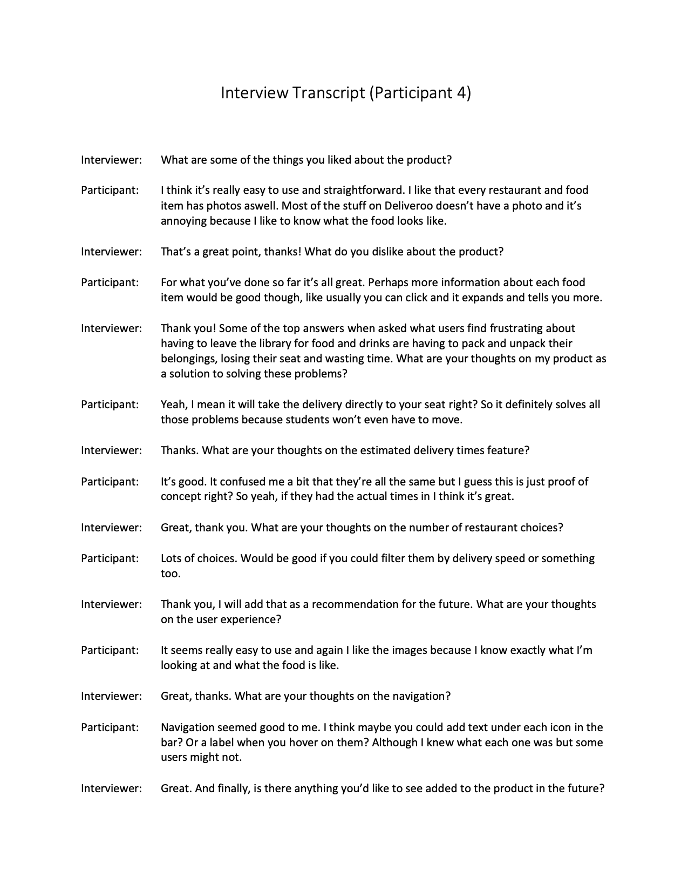

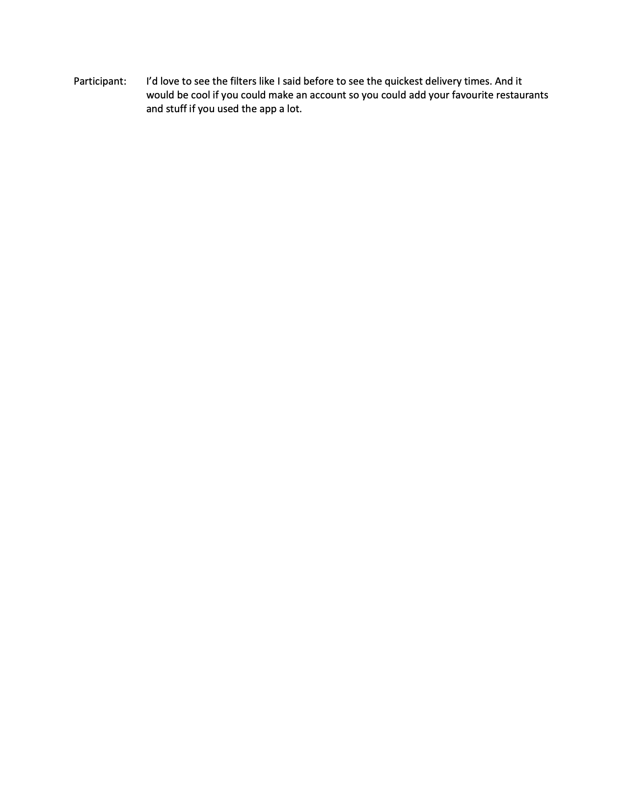

 

##### Interview 5:

 

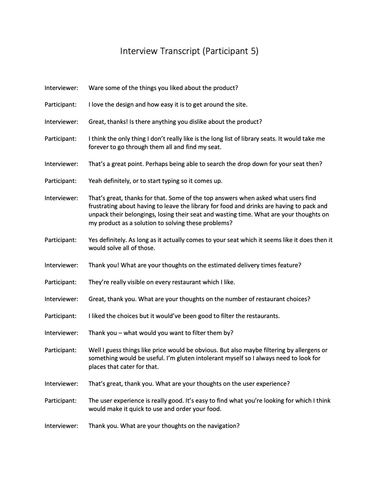

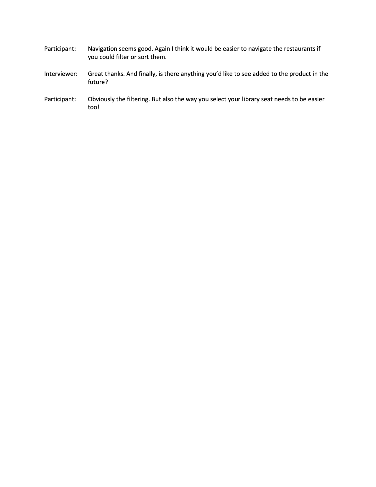